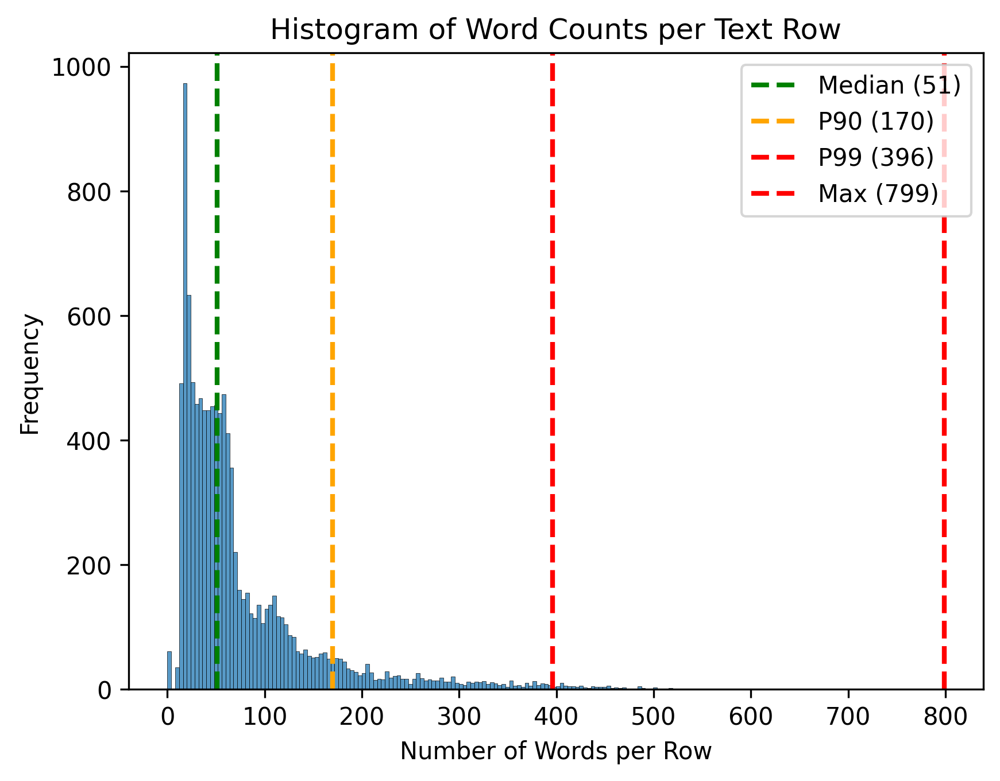

# agentic_text_analyzer

## Project Summary:

The goals of this project are: <br><br>
1 - to build a system that can perform "information/entity extraction" and "text summarization" on a set of unstructured text documents. <br><br>
2 - Design how an AI agent can use both summarization/extraction methods as tools to answer complex questions or perform specific tasks by navigating multiple documents.

## Project Structure
```bash
|README.md
|requirements.txt
|notebooks/
|-- step1_preprocess.ipynb
|-- step2_entity_extraction_summarization.ipynb
|assets/
```
## Python package set-up:

```bash
cd AGENTIC_TEXT_ANALYZER

# Create and activate the virtual environment
python3 -m venv myenv
source myenv/bin/activate

# Install dependencies
pip install -r requirements.txt
```
The prepared virtual environment would need to be mounted as a kernel for jupyter notebooks to run on.

## EDA on Text Data 
**Source notebook**: notebooks/step1_preprocess.ipynb <br>

**Source text documents**: nltk's reuters corpus <br><br>
This notebook performs the following:
- Downloads and prepares the text dataset
- Cleans the text (regular expression, lemmatization, removing stop-words).
- Applies limited EDA based on tokenization.

This figure shows the histogram of tokenized word frequency:


**Figure 1** Tokenized word frequency for text documents (nearly 10k documents). The median token size for single documents is ~50.

To-do EDA plots:<br><br>
1 - histogram for this ratio: length of tokenized words / total length of documents<br>
2 - histogram for this ratio: length of extracted important entities / length of tokenized words

## Developing entity-extraction methods
**Source notebook**: notebooks/step2_entity_extraction_summarizations.ipynb

Using the text cleaning method developed in the previous step, we devised a few techniques for information extraction including the following:

### 1. rule-based entity extraction using part-of-speech (pos) tags
We used the following pos to extract the important entities:
```
pos_family = {
    'noun' : ['NN','NNS','NNP','NNPS'],
    'pron' : ['PRP','PRP$','WP','WP$'],
    'verb' : ['VB','VBD','VBG','VBN','VBP','VBZ'],
    'adj' :  ['JJ','JJR','JJS'],
    'adv' : ['RB','RBR','RBS','WRB']
}
```
**Pros:**<br>
- Very easy to implement.
- High recall.

**Cons:**<br>
- Low precision on what's important.
- Shallow semantic/contextual understanding.

### 2. Named Entity Recognition (NER)-based entity extraction

We devised a simple formula to extract and score the importance of entities using the following workflow:<br><br>
1 - Prescribe a list of important NER's for our corpus:
```
IMPORTANT_LABELS = [
    "PERSON","ORG","GPE","LOC","DATE","TIME","MONEY","NORP","EVENT","PRODUCT"
]
```
2 - assign a score as follows:<br>

```
Score = frequency of occurrence + 0.25 * length of entity
```
3 - Descending sort by score, and return top-k entities for each document.

**Pros:**<br>
- Pretty effective in terms of functionality, while relatively low-latency.
- High potential to be coupled with more advanced methods.<br>

**Cons:**<br>
- Subjective choice of important NER's.
- Lack of assigning importance based on intra-sentence and inter-sentence contextual relations.

### 3. Transformer-based generative extraction (few-shot)

We used a light-weight LLM "google/flan-t5-base"[https://huggingface.co/google/flan-t5-base], that we can later user as tool for our agents.

**Pros:**
<br>
- The initial results are decent.<br>

**Cons:**<br>
- The model output still needs to turn into structured json format to be appropriate for agentic integrations, so need experimentation and more implementation of guardrailing/error-handling.

## Developing summarization methods
**Source notebook**: notebooks/step2_entity_extraction_summarizations.ipynb

### 1. tf-idf-based summarization

We used a simple tf-idf-based sentence scoring technique, and returned top important sentences as a proxy for summarization.

**Pros:**
- Easy to implement.<br>

**Cons:**
- Too basic. No contextual understanding.

### 2. abstractive summarization
We used a simple fine-tuned "facebook/bart-large-cnn" model [https://huggingface.co/facebook/bart-large-cnn] which did a decent job out-of-the-box.

**Pros:**
- decent out-of-the-box performance
- Can easily be distilled for better runtime latencies for production settings.<br>

**Cons:**
- Results could be better. The generated summaries did not break down the sentence enough to extract the main topics while staying concise.

## Evaluating Summarization Techniques

We benchmarked our two summarization methods on huggingface dataset "cnn_dailymail". The target metric was ROUGE [https://en.wikipedia.org/wiki/ROUGE_(metric)]. Abstractive method did better all around. However, there are some caveats in our eval method, and we need to go further exploring other aspects of evaluation like factuality, etc.


## Agentic System Concept:

### 1. Agentic Scenarios

Healthcare is a mainstream market, where there is both a massive historical text documents, and also an influx of academic/clinical documents being injected into the current state of our knowledge on a daily basis. A healthcare AI assistant is needed today more than ever. The AI assistant would be the first go-to resource to help practitioners answer their questions about both public and private text corpus, so they can have the most relevant information at their fingertip.

### 2. Agent's architecture
#### 2.1 Agent's goal:
**Primary goal:**
Returning concise, accurate, grounded, fresh answers with structured summaries (e.g., symptoms, practices, risks, follow-ups, etc.), alongside structured json outputs, that Front-end team can use to create hyperlink if users are interested in digging into the source-of-truth for the answers.

**Secondary goals:**
Keeping in-session/inter-session memory to retain patient-based historical data/conversation context in order to maximize the relevance of returned answers and references. Also, using this tracked information to look for longer-term risk factors (e.g., symptoms for subtle chronic life-threatening diseases).

#### 2.2 Agent's Tools:
**Intent-detection**<br> 
To detect and evaluate intents for user question (queries).<br>

**entity-extractor**<br> 
offline use case: to extract entities from the exiting references to index them into BM25/semantic index stores for later retrieval stage, once agent asks for retrieval.<br>
online use case: tag query components for user questions; also, to extract important entities before returning final answer.<br>

**text-summarization**<br>
 offline use case: helps for fine-tuning the corpus embeddings for better retrieval accuracy.<br>
 online use case: for text summarization when returning final text (will also help for more complex multi-agent architectures).<br>

**Lexical/Semantic indexer/retrieval**<br> 
To help during retrieval stage and maintain structured metadata (e.g., expiration filters) for references. Metadata also helps doing post-retrieval reranking before returning results to agent<br>

**Guardrails:**<br>
Input/output guardrails. 

#### 2.3 Agent Architecture
For an MVP implementation, we can use single agent architecture to answer to simpler questions such as "what is the guideline if after receiving my flu shot I experience nausea". For more complex questions such as "write a report on this hospital's performance for pediatric practices in year 2025", we can think about multi-agent architectures such as manager-worker etc.<br><br> 

Just as an example, we track the flow of single agent using "Plan-and-Execute" orchestration pattern:<br>

1. [Intent-detection] If intent not clear, clarify intent.<br>
2. [entity-extractor tool call] Detect query tags such as {"task type": "guideline", "symptom": "nausea"}<br>
3. [retrieval tool call] Retrieve relevant and accurate top documents based on input query (public references and private clinical history)<br>
4. [LLM memory] Retrieve patient's conversation/clinical history (more work is needed here for better reasoning).<br>
5. [entity-extractor tool call] Extract relevant clinical facts from each retrieved document using entity recognition.<br>
6. [text-summarization tool call] summarize relevant results based on step 5 for each document.<br>
7. [text-summarization tool call] merge documents to generate top relevant information.<br>
8. [guardrails tool call] validate factuality/relevance, and enriching text by mentioning uncertainties associated with the current assessment.<br>
9. Return response blurb along with references.


